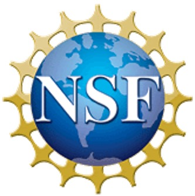

### Background

Primary metabolites, such as proteins and cell walls, construct the plant body and hence directly impact yield, quality, and performance of crops. Primary metabolic pathways are, however, often difficult to manipulate due to their vital nature and integration into complex metabolic networks. To overcome this challenge **this research will explore primary metabolic diversity to uncover major evolutionary innovations of plant metabolism** and to provide novel tools and strategies to rationally optimize these core metabolic processes in plants. 

### Research aims

Specifically, this research aims to investigate coordinated evolution of **the tyrosine-derived lignin biosynthetic pathway** uniquely evolved in grasses, which provide major sources of our calories (e.g. wheat, maize, rice) and bioenergy production (e.g. sugar cane, sorghum, switchgrass). While lignin and other phenylpropanoid compounds are typically derived from L-phenylalanine in most plants, grasses synthesize these compounds additionally from L-tyrosine. Fundamental understanding of the tyrosine-derived lignin and other natural product pathways will enable optimization of amino acid and cell wall biosynthesis to improve yield and quality of foods, fuels, and biomaterials. 

### Outreach

To increase the awareness of the importance of plant natural products, we will conduct **“Pigment Art”** and other outreach activities, targeted to K-12 students especially from underrepresented communities (see our outreach activity here).  We are also building a novel plant chemical database (termed **phylochemical database**) with students to study diversity and complexity of plant biochemical traits in light of evolution.

### Funding

This project is funded by NSF PGRP. 
<a href="https://www.nsf.gov/awardsearch/showAward?AWD_ID=1836824&HistoricalAwards=false">“MCA-PGR: Phylogeny-Guided Biochemical Genomics to Elucidate the Tyrosine-Derived Lignin Metabolic Network of Grasses”</a> 

